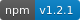

# courtbot-engine-data-oscn   

This is a data source for courtbot-engine that pulls case data from oscn (Oklahoma State Court Network).

##Usage

~~~javascript
var courbot=require("courtbot-engine");
require("courtbot-engine-data-oscn")("tulsa", "https://oscn-case-api.herokuapp.com");

...

courtbot.addRoutes(app, {
  dbUrl: databaseurl,
  <other options>
});
~~~
